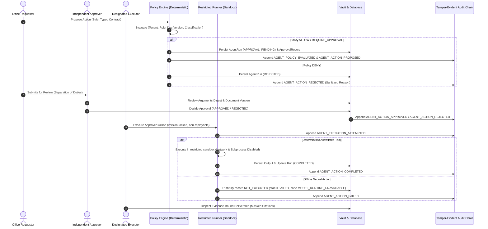

# Policy-Gated Local Agent & Deliverable Governance Workflow

## Architectural Boundary & Guarantees

KoshShield AI operates strictly **local-first** and **air-gapped**. An AI agent proposes government-office work, but **cannot directly perform risky actions** or invoke tools without deterministic policy evaluation and persisted human authorization.

- **Zero Hosted AI / External Calls**: No cloud APIs, external endpoints, remote telemetry, or hosted models.
- **Originals in Encrypted Vault**: Unredacted documents remain solely in the AES-256-GCM encrypted vault. Retrieval, audit, and deliverables consume only privacy-masked content and safe hashes.
- **Fail-Closed Offline Neural Runtime**: When local models (Qwen, BGE-M3, llama.cpp) are unavailable, the system truthfully returns `NOT_EXECUTED` with code `MODEL_RUNTIME_UNAVAILABLE`.
- **Non-Binding Deliverables**: Deliverables carry structured provenance and citations to masked evidence chunks; they never claim legal validity, statutory DPDP certification, or final administrative approval.

---

## The 7-Stage Governance Workflow

---

### Step 1: Select Approved Document
The workflow begins with an approved, privacy-redacted, and indexed document:
- Document must be in `INDEXED` status in the active tenant.
- Chunks and visual regions are verified by the privacy gate (zero unapproved PII findings).
- Target document version is captured and bound to the action request.

### Step 2: Request Action Contract
The requester submits an action request through `POST /api/v1/agent/runs`.
Permitted action types:
1. `calculator`: Pure arithmetic evaluation via AST parser (max 64KB, bounds checked).
2. `calculate_procurement_comparison`: Multi-criteria vendor bid matrix evaluation against tender specifications.
3. `draft_approval_note`: Formal requisition note for administrative approval.
4. `draft_report`: Structured governance and compliance summary report.
5. `generate_verified_code`: Safe template code generation (audit hashers, CSV validators, procurement checks).
6. `document_report`: Document metadata and extraction verification report.
7. `summarize_document`: Model-backed synthesis requiring local neural runtime.

**Contract Enforcement**:
- Strict Pydantic models with `extra = "forbid"`.
- Indian PII scanner verifies arguments contain no Aadhaar, PAN, phone, or bank details.
- Prompt injection patterns (`system prompt`, `ignore instructions`) are rejected immediately.
- Payloads capped at 64 KB.

### Step 3: Policy Decision (Fail-Closed)
The `AgentPolicyEngine` deterministically evaluates the request:
- **Decision Verdicts**:
  - `ALLOW`: Low-risk read-only / arithmetic actions with authorized roles.
  - `REQUIRE_APPROVAL`: Actions modifying office workflow, processing confidential data, or requiring reviewer confirmation.
  - `DENY`: Unauthorized actions, missing documents, unapproved documents, or cross-tenant attempts.
- Fails closed when context or document version is missing.
- Model output **never** bypasses policy.

### Step 4: Human Approver Review (Separation of Duties)
- **Separation of Duties**: The requester cannot approve their own action (`SeparationOfDutiesError`).
- **TTL Expiration**: Pending approvals expire after 24 hours (default `DEFAULT_APPROVAL_TTL_SECONDS`).
- **Replay Protection**: An approval can only transition once (`PENDING -> APPROVED` or `PENDING -> REJECTED`). Duplicate execution or approval attempts are rejected with HTTP 409 Conflict.
- **Stale Document Detection**: If the underlying document version is incremented during review, execution is blocked with `StaleDocumentVersionError`.

### Step 5: Restricted Tool Execution
Execution occurs through `POST /api/v1/agent/runs/{id}/execute`:
- **Deterministic Tools**:
  - Handled by pure Python allowlisted functions in `RestrictedDeterministicToolRunner`.
  - Enforces network disabled, no shell execution, no filesystem access outside vault, no SQL execution.
  - Output schema is validated and output hash is cryptographically calculated.
- **Model-Backed Actions**:
  - If Qwen / llama.cpp runtime is unavailable, execution returns `status: FAILED` with stable failure code `MODEL_RUNTIME_UNAVAILABLE`.
  - Never fakes an inference response.

### Step 6: Evidence-Bound Deliverables
Deliverables are retrieved via `GET /api/v1/agent/runs/{id}/deliverable`:
- Bound to citations referencing masked document chunks (`chunk_id`, `page_number`, `masked_snippet`, `snippet_hash`).
- Explicit provenance metadata: action type, policy result, approval ID, document ID, versions, verification status.
- Mandatory non-binding disclaimer attached to every deliverable.

### Step 7: Audit Timeline & Operational Visibility
Every stage emits tamper-evident audit records:
- `AGENT_POLICY_EVALUATED`
- `AGENT_ACTION_PROPOSED` / `AGENT_ACTION_REJECTED`
- `AGENT_ACTION_APPROVED` / `AGENT_ACTION_REJECTED`
- `AGENT_EXECUTION_ATTEMPTED`
- `AGENT_ACTION_COMPLETED` / `AGENT_ACTION_FAILED`

**Sanitization Boundary**:
- Details dictionaries contain **strictly metadata**: `run_id`, `tenant_id`, `tool_name`, `classification`, `arguments_hash`, `policy_decision`, `failure_code`.
- **Zero Raw Data**: Never contains raw user prompts, model system instructions, extracted unredacted document text, Indian PII, local file paths, or exception stack traces.
